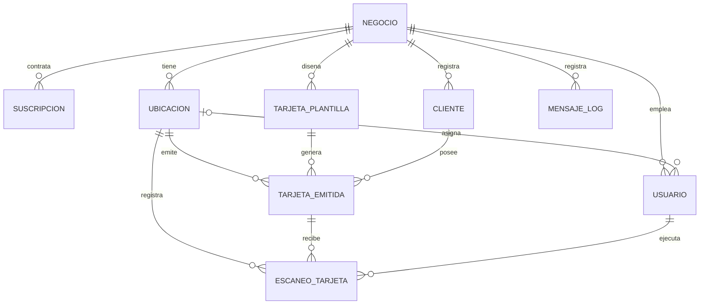
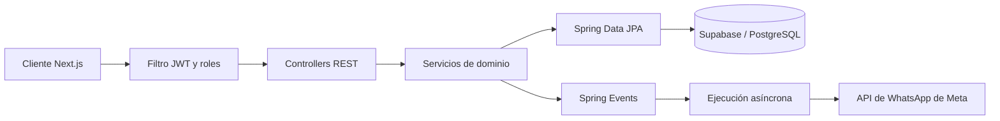

# FitelyBack SaaS — Backend

> **Empresa:** Cala Negocios e Inversiones S.A.C.
>
> **Proyecto:** Backend completo con arquitectura multitenant
>
> **Autores:** Manuel Aguirre, José Huamaní
>
> **Repositorio:** [github.com/Manolooo04/FitelyBack-Cala-Backend](https://github.com/Manolooo04/FitelyBack-Cala-Backend)
>
> **Despliegue:** pendiente (URL objetivo: `http://api.fitelyback.com/api/v1`)
>
> **Swagger:** pendiente (URL objetivo: `http://api.fitelyback.com/swagger-ui/index.html`)

---

## Índice

1. [Introducción](#1-introducción)
2. [Problema y justificación](#2-problema-y-justificación)
3. [Solución: módulos y tecnologías](#3-solución-módulos-y-tecnologías)
4. [Estado del proyecto](#4-estado-del-proyecto)
5. [Modelo de entidades](#5-modelo-de-entidades)
6. [Arquitectura](#6-arquitectura)
7. [Seguridad y multitenancy](#7-seguridad-y-multitenancy)
8. [Manejo de errores](#8-manejo-de-errores)
9. [Eventos y asincronía](#9-eventos-y-asincronía)
10. [Endpoints](#10-endpoints)
11. [Puesta en marcha](#11-puesta-en-marcha)
12. [GitHub y gestión](#12-github-y-gestión)
13. [Criterios y evidencia](#13-criterios-y-evidencia)
14. [Conclusión](#14-conclusión)

---

## 1. Introducción

FitelyBack es una plataforma SaaS B2B de fidelización que permite a franquicias y negocios administrar programas de lealtad sin fricción para el cliente final. El sistema combina tarjetas digitales nativas (Apple Wallet y Google Wallet) con comunicación automatizada por la API oficial de WhatsApp Cloud.

Este repositorio contiene el backend: una API REST versionada bajo `/api/v1`, construida con Spring Boot sobre PostgreSQL (Supabase). Aplica una arquitectura *multitenant* estricta, en la que cada negocio solo accede a sus propios datos, y una organización por módulos con capas Controller → Service → Repository.

---

## 2. Problema y justificación

Los programas de fidelización tradicionales exigen que el cliente descargue una aplicación de terceros, lo que genera fricción y abandono. Además, la comunicación posterior depende de correos electrónicos con tasas de apertura bajas.

FitelyBack resuelve el problema apoyándose en herramientas que el cliente ya usa a diario. El cliente escanea un QR en la tienda, guarda su tarjeta en el Wallet de su teléfono y, desde ese momento, la retención se gestiona de forma automática por WhatsApp. Para el dueño del negocio, el sistema ofrece un panel que consolida métricas, gestión del equipo y control de la reputación, sin carga operativa para el personal de tienda.

---

## 3. Solución: módulos y tecnologías

### Roles

| Rol | Quién es |
|---|---|
| `ADMIN` | Dueño del negocio que adquirió el SaaS. Configura el negocio y accede a todo. |
| `STAFF` | Trabajador invitado por el negocio. Opera en caja dentro de su sede asignada. |

### Módulos funcionales

| Módulo del panel | Qué hace |
|---|---|
| **Parámetros** | Centro de análisis en tiempo real: visitas, clientes nuevos y recurrentes, ticket promedio, ingresos estimados, gráficas por período y actividad en vivo. Filtra por tipo de programa. |
| **Tarjetas** | Creación y personalización de tarjetas de lealtad en tres modalidades: estampillas (sellos hasta una recompensa), niveles (membresías VIP con beneficios escalonados) y giftcards (saldo prepago recargable). |
| **Clientes** | Base de datos de los clientes del negocio: ficha, progreso, canjes, búsqueda, filtros, historial de transacciones y exportación a Excel/CSV. |
| **Equipo** | Administración del personal: rol, sede asignada, acceso a tiendas y PIN de seguridad para la interfaz de escaneo en caja. |
| **Geolocalización** | Coordenadas y radio de detección por sede (geovallas) para notificaciones en la pantalla de bloqueo a través del Wallet, y creación de audiencias por zona. |
| **WhatsApp** | Centro de mensajería: automatizaciones (bienvenida, nueva estampilla, premio listo, cumpleaños, reactivación de inactivos), **campañas** masivas con filtros de audiencia y botones interactivos, plantillas, desuscritos y métricas de entrega y lectura. |
| **Historial** | CRM de reputación: encuestas post-visita de 1 a 5 estrellas. Las calificaciones altas se invitan a publicar en Google Maps o TripAdvisor; las bajas quedan como casos de atención prioritaria dentro de la plataforma. |
| **Funciones** | Guías de uso y buenas prácticas. Es contenido del frontend y no requiere backend. |
| **Configuración** | Perfil, marca, sedes, número remitente de mensajes, suscripción y cierre de cuenta. |

Las campañas forman parte del módulo de WhatsApp porque la plataforma no contempla envíos por correo electrónico.

### Tecnologías

**En uso**

- Java 26 y Spring Boot 4.1.1
- Spring Data JPA con Hibernate 7
- PostgreSQL 17 en Supabase (conexión por el pooler de transacciones)
- Spring Security con JWT (jjwt 0.12.6) y BCrypt
- Bean Validation sobre DTOs
- Lombok
- Maven
- GitHub Actions para integración continua

**Planificadas**

- Swagger / OpenAPI para la documentación de la API
- MapStruct para el mapeo entre entidades y DTOs
- PostGIS para consultas espaciales
- Meta Graph API (WhatsApp Cloud API)
- JUnit 5 y Mockito para pruebas unitarias y de integración

---

## 4. Estado del proyecto

| Componente | Estado |
|---|---|
| Registro de negocio y usuario dueño | Implementado |
| Login con JWT y endpoint de perfil (`/me`) | Implementado |
| Filtro JWT y rutas protegidas por defecto | Implementado |
| Roles `ADMIN` y `STAFF` con `@PreAuthorize` | Implementado |
| Aislamiento por negocio (multitenancy) | Implementado |
| Módulo de clientes (CRUD) | Implementado |
| Manejo global de errores y validaciones | Implementado |
| Secretos en variables de entorno | Implementado |
| Integración continua (GitHub Actions) | Implementado |
| Ubicaciones (sedes) | Planificado |
| Equipo (trabajadores, sedes asignadas, PIN) | Planificado |
| Tarjetas (plantillas y tarjetas emitidas) | Planificado |
| Escaneos (sellos, canjes, recargas) | Planificado |
| Métricas | Planificado |
| WhatsApp (canal, automatizaciones, campañas, audiencias) | Planificado |
| Reseñas | Planificado |
| Suscripción y cuotas de mensajes | Planificado |
| Swagger, pruebas automatizadas y despliegue | Planificado |

---

## 5. Modelo de entidades

El modelo se basa en el aislamiento por `negocio_id`. Las entidades principales son nueve:

| Entidad | Propósito | Estado |
|---|---|---|
| `Negocio` | Tenant raíz. Datos de la empresa y credenciales de Meta. | Implementada |
| `Usuario` | Acceso al panel: dueños (`ADMIN`) y personal (`STAFF`). | Implementada |
| `Cliente` | Consumidor final, identificado por su teléfono dentro de cada negocio. | Implementada |
| `Ubicacion` | Sede física. Separa métricas y limita el acceso del personal por local. | Planificada |
| `Suscripcion` | Plan contratado y saldo de mensajes de WhatsApp. | Planificada |
| `TarjetaPlantilla` | Diseño maestro de la tarjeta: tipo, colores, meta de sellos, reglas. | Planificada |
| `TarjetaEmitida` | Tarjeta de un cliente: progreso actual y estado en Wallet. | Planificada |
| `EscaneoTarjeta` | Registro inmutable de cada lectura de QR (sello, canje o recarga). | Planificada |
| `MensajeLog` | Registro de cada mensaje enviado y su estado según los webhooks de Meta. | Planificada |

Los módulos de WhatsApp y reseñas añadirán más adelante `Campana`, `PlantillaMensaje`, `Desuscrito`, `Audiencia` y `Resena`.

### Diagrama ER



Todas las relaciones usan carga `LAZY` explícita.

---

## 6. Arquitectura

El backend se organiza por funcionalidad (*package by feature*). Cada módulo contiene sus propias capas Controller → Service → Repository y sus DTOs.

### Estructura de packages

```
com.fitelyback.backend
 ├─ config            configuración web
 ├─ security          filtro JWT, servicio de tokens, reglas de acceso
 ├─ exception         excepción de negocio y manejador global
 ├─ events            eventos de dominio
 ├─ scheduler         tareas programadas
 └─ modules
     ├─ tenant            Negocio, Suscripcion, auth, ajustes de marca
     ├─ ubicaciones       sedes: dirección, horario, coordenadas y radio
     ├─ equipo            trabajadores, roles, PIN, sedes asignadas
     ├─ clientes          clientes, búsqueda, filtros, exportación
     ├─ tarjetas          plantillas y tarjetas emitidas
     ├─ escaneos          sellos, canjes y recargas
     ├─ whatsapp
     │   ├─ canal              cliente de Meta, webhook, registro de mensajes, cuota
     │   ├─ automatizaciones   bienvenida, sello, premio, cumpleaños, reactivación
     │   ├─ campanas           campañas, plantillas, desuscritos
     │   └─ audiencias         segmentos por sede, nivel, inactividad o zona
     ├─ resenas           encuestas, opiniones y casos de atención
     └─ metricas          KPIs y actividad en vivo
```

Hoy existen `tenant` (con `auth`) y `clientes`; este último se encuentra por ahora dentro de `tenant`.

### Flujo de una petición



### Decisiones de diseño del módulo de WhatsApp

- **Un único servicio de envío.** Automatizaciones y campañas envían a través del subpackage `canal`. Así el descuento de la cuota del plan, la revisión de desuscritos y el registro en `MensajeLog` ocurren en un solo lugar.
- **Patrón Strategy para los disparadores.** Cada tipo de mensaje (bienvenida, sello, premio, cumpleaños, reactivación) se implementa como una estrategia independiente, sin condicionales anidados.
- **Campañas por lotes en segundo plano.** El endpoint crea la campaña y responde de inmediato; el envío avanza de forma asíncrona y guarda su progreso.
- **Plantillas con estado de aprobación.** Solo se pueden programar campañas con plantillas aprobadas por Meta.

---

## 7. Seguridad y multitenancy

- **Autenticación con JWT.** `JwtAuthenticationFilter` lee el header `Authorization: Bearer <token>`, valida la firma y la expiración, y carga al usuario en el contexto de seguridad. El token incluye el correo, el `negocioId` y el rol, y expira a las 24 horas.
- **Rutas protegidas por defecto.** Solo `POST /api/v1/auth/register` y `POST /api/v1/auth/login` son públicas. Cualquier otro endpoint exige un token válido; sin él responde `401`.
- **Aislamiento de datos.** El `negocioId` nunca se recibe en la URL ni en el cuerpo de la petición: se toma del token. Cada consulta filtra por ese negocio, de modo que pedir un recurso de otro negocio devuelve `404`.
- **Control por rol.** `@PreAuthorize("hasRole('ADMIN')")` restringe las operaciones de configuración y las destructivas. Un usuario autenticado sin el rol requerido recibe `403`.
- **Contraseñas.** Se almacenan con hash BCrypt.
- **Secretos fuera del código.** La contraseña de la base de datos y la clave de firma del JWT se leen de variables de entorno. El archivo `.env` está excluido del repositorio.
- **DTOs.** Las entidades JPA no se exponen; las respuestas usan DTOs (Records en los módulos nuevos).

Queda planificado restringir al personal `STAFF` a su sede asignada cuando exista el módulo de ubicaciones.

---

## 8. Manejo de errores

Un `@RestControllerAdvice` centraliza las respuestas de error con un formato único.

| Situación | Código HTTP |
|---|---|
| Datos que no pasan las validaciones | 400 Bad Request |
| Cuerpo de la petición que no es JSON válido | 400 Bad Request |
| Credenciales inválidas, token ausente o inválido | 401 Unauthorized |
| Rol sin permiso para la operación | 403 Forbidden |
| Recurso inexistente o de otro negocio | 404 Not Found |
| Dato duplicado (correo o teléfono ya registrado) | 409 Conflict |
| Error inesperado (se registra en el log, sin exponer el detalle) | 500 Internal Server Error |

Los errores de negocio se lanzan con `ApiException`, que lleva su propio código HTTP. Con los módulos pendientes se añadirán casos como cuota de mensajes agotada (`402`), fallo de entrega en Meta (`502`) y firma de QR inválida (`400`).

Ejemplo de respuesta ante un error de validación:

```json
{
  "timestamp": "2026-10-04T01:05:00",
  "status": 400,
  "error": "Bad Request",
  "message": "Datos inválidos",
  "path": "/api/v1/auth/register",
  "fieldErrors": {
    "email": "El correo no tiene un formato válido"
  }
}
```

En los errores que no son de validación, `fieldErrors` se devuelve vacío.

---

## 9. Eventos y asincronía

La operación en tienda no puede depender de la latencia de servicios externos. Por eso la comunicación con WhatsApp se desacopla mediante eventos. El proyecto ya tiene habilitados `@EnableAsync` y `@EnableScheduling`; el flujo siguiente se completará con los módulos de escaneos y WhatsApp:

1. El personal lee el QR de un cliente (`POST /api/v1/escaneos`).
2. El servicio guarda el `EscaneoTarjeta`, publica un evento y responde de inmediato.
3. Un método `@Async` recibe el evento en un hilo secundario.
4. En segundo plano se valida la cuota del plan, se arma el mensaje y se llama a la API de Meta.

Para la retención pasiva, tareas `@Scheduled` buscarán de madrugada a los clientes inactivos y a quienes cumplen años, y encolarán los envíos correspondientes.

---

## 10. Endpoints

### Implementados

| Método | Endpoint | Descripción | Acceso |
|---|---|---|---|
| `POST` | `/api/v1/auth/register` | Registra un negocio y su usuario dueño | Público |
| `POST` | `/api/v1/auth/login` | Inicia sesión y emite el JWT | Público |
| `GET` | `/api/v1/auth/me` | Perfil del usuario autenticado | ADMIN / STAFF |
| `GET` | `/api/v1/clientes` | Lista los clientes del negocio | ADMIN / STAFF |
| `GET` | `/api/v1/clientes/{id}` | Obtiene un cliente | ADMIN / STAFF |
| `POST` | `/api/v1/clientes` | Registra un cliente | ADMIN / STAFF |
| `PUT` | `/api/v1/clientes/{id}` | Actualiza un cliente | ADMIN / STAFF |
| `DELETE` | `/api/v1/clientes/{id}` | Elimina un cliente | ADMIN |

### Planificados

| Método | Endpoint | Descripción | Acceso |
|---|---|---|---|
| `GET` | `/api/v1/ubicaciones` | Lista las sedes del negocio | ADMIN / STAFF |
| `POST` | `/api/v1/ubicaciones` | Crea una sede (valida el límite del plan) | ADMIN |
| `POST` | `/api/v1/equipo` | Registra un trabajador y le asigna sede | ADMIN |
| `POST` | `/api/v1/tarjetas-plantilla` | Crea el diseño de un programa | ADMIN |
| `GET` | `/api/v1/tarjetas-emitidas` | Lista el progreso (filtro `?ubicacionId=`) | ADMIN / STAFF |
| `POST` | `/api/v1/escaneos` | Registra la lectura de un QR en una sede | ADMIN / STAFF |
| `GET` | `/api/v1/metricas` | KPIs y actividad en vivo | ADMIN / STAFF |
| `POST` | `/api/v1/whatsapp/campanas` | Crea y programa una campaña | ADMIN |
| `POST` | `/api/v1/webhooks/whatsapp` | Recibe los estados de mensajes desde Meta | Público (con secreto) |
| `GET` | `/api/v1/resenas` | Lista opiniones y casos de atención | ADMIN / STAFF |

---

## 11. Puesta en marcha

### Requisitos

- JDK 26
- Maven
- Acceso a la base de datos del proyecto en Supabase

### Variables de entorno

El archivo `.env` **nunca** debe subirse al repositorio. Copia `.env.example` como `.env` y completa los valores:

```env
# Contraseña de la base de datos en Supabase
DB_PASSWORD=

# Clave para firmar los tokens JWT (Base64, mínimo 256 bits)
JWT_SECRET=
```

Para generar una clave JWT en PowerShell:

```powershell
$b = New-Object byte[] 32; [Security.Cryptography.RandomNumberGenerator]::Create().GetBytes($b); [Convert]::ToBase64String($b)
```

### Ejecución

Desde IntelliJ IDEA, ejecuta la configuración `BackendApplication` con el archivo `.env` cargado como variables de entorno.

Desde la terminal (PowerShell):

```powershell
$env:DB_PASSWORD="tu_contraseña"
$env:JWT_SECRET="tu_clave"
mvn spring-boot:run
```

La API queda disponible en `http://localhost:8080/api/v1`.

### Prueba rápida

1. `POST /api/v1/auth/register` con `nombreEmpresa`, `nombre`, `apellido`, `email` y `password`.
2. `POST /api/v1/auth/login` con `email` y `password`; la respuesta incluye el `token`.
3. Envía ese token en el header `Authorization: Bearer <token>` para el resto de endpoints.

---

## 12. GitHub y gestión

- **Integración continua.** Un workflow de GitHub Actions (`.github/workflows/maven.yml`) compila el proyecto y ejecuta las pruebas con Java 26 en cada push y pull request hacia `main`. Las credenciales se inyectan desde los secretos del repositorio (`DB_PASSWORD`, `JWT_SECRET`).
- **Ramas.** El equipo sigue la convención `feature/*`, `fix/*` y `refactor/*`, con validación de cada pull request antes de integrar.
- **Planificación.** Los tickets y milestones del MVP se administran en GitHub Projects.

---

## 13. Criterios y evidencia

| Criterio | Evidencia del proyecto | Estado |
|---|---|---|
| Entidades | Entidades relacionales aisladas por `negocio_id` (`Negocio`, `Usuario`, `Cliente`). | En curso: 3 de 9 |
| DTOs y mapeo | DTOs con Bean Validation; Records en los módulos nuevos. | Implementado; MapStruct planificado |
| Arquitectura | Organización por funcionalidad con capas Controller → Service → Repository. | Implementado; Strategy planificado |
| Excepciones | `@RestControllerAdvice` con formato de respuesta único. | Implementado |
| Seguridad | Filtro JWT, multitenancy, roles con `@PreAuthorize`, BCrypt y secretos en variables de entorno. | Implementado; restricción por sede planificada |
| Asincronía | `@EnableAsync` y `@EnableScheduling` habilitados. | Base lista; flujo con Meta planificado |
| Diseño REST | Verbos HTTP correctos, recursos en plural y versión `/v1/`. | Implementado |
| Integración continua | GitHub Actions en cada push a `main`. | Implementado |

---

## 14. Conclusión

El backend de FitelyBack establece la base de un SaaS B2B escalable: autenticación con JWT, control de acceso por rol, aislamiento estricto de los datos de cada negocio y un manejo de errores uniforme, todo verificado por integración continua.

Sobre esa base se construirán los módulos que completan el producto: sedes, equipo, tarjetas y escaneos como núcleo operativo, seguidos de métricas, mensajería por WhatsApp y reputación. El diseño por módulos y el desacoplamiento mediante eventos permiten registrar lecturas de QR en tiempo real y enviar notificaciones automáticas sin afectar el rendimiento de la operación en tienda.
