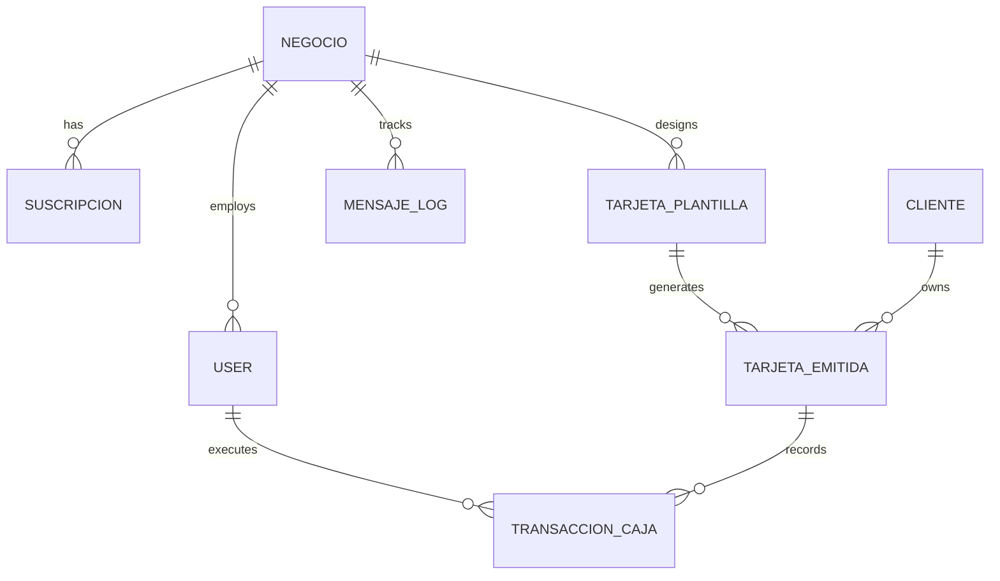
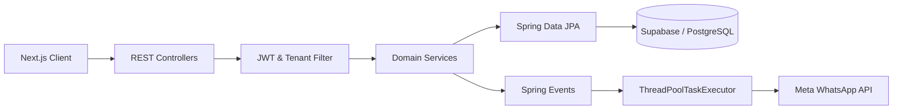

# FitelyBack SaaS — Backend

> **CS 2031 · Desarrollo Basado en Plataforma**
> **Proyecto · Backend Completo — Arquitectura Multitenant**
> **Autor:** Manuel Aguirre
>
> **Repositorio:** [https://github.com/Jmanolo2004/fitelyback-saas-backend](https://github.com/Jmanolo2004/fitelyback-saas-backend)
> **Deployment (AWS + Supabase):** [http://api.fitelyback.com/api/v1](http://api.fitelyback.com/api/v1)
> **Swagger:** [http://api.fitelyback.com/swagger-ui/index.html](http://api.fitelyback.com/swagger-ui/index.html)

---

## Índice

1. [Introducción](#1-introducción)
2. [Problema y justificación](#2-problema-y-justificación)
3. [Solución: funcionalidades y tecnologías](#3-solución-funcionalidades-y-tecnologías)
4. [Modelo de entidades](#4-modelo-de-entidades)
5. [Arquitectura](#5-arquitectura)
6. [Manejo de errores](#6-manejo-de-errores)
7. [Seguridad y Multitenancy](#7-seguridad-y-multitenancy)
8. [Eventos y asincronía](#8-eventos-y-asincronía)
9. [GitHub & Management](#9-github--management)
10. [Conclusión](#10-conclusión)
11. [Apéndices](#11-apéndices)
12. [Criterios cubiertos por la rúbrica](#12-criterios-cubiertos-por-la-rúbrica)

---

## 1. Introducción

FitelyBack es una plataforma SaaS B2B de fidelización multicanal que permite a franquicias y negocios administrar programas de lealtad sin fricción. El sistema integra tarjetas digitales nativas (Apple Wallet y Google Wallet) y un CRM completamente automatizado impulsado por la API oficial de WhatsApp Cloud.

El backend centraliza una arquitectura *multitenant* estricta, aislando la gestión de sucursales, clientes, plantillas de tarjetas, transacciones de caja y telemetría de mensajería.

El proyecto expone una API REST versionada bajo `/api/v1`, utiliza PostgreSQL (Supabase) y aplica una arquitectura de capas Controller → Service → Repository. Cumple con los criterios técnicos avanzados: modelo relacional con aislamiento de datos, DTOs inmutables (Records), manejo global de excepciones, seguridad JWT con RBAC, asincronía estricta para APIs de terceros y documentación OpenAPI.

---

## 2. Problema y justificación

Los programas de fidelización tradicionales exigen que el cliente descargue aplicaciones pesadas de terceros, lo que genera una alta fricción y abandono. Además, la comunicación posterior depende de correos electrónicos con bajas tasas de apertura.

FitelyBack resuelve este problema centralizando la experiencia en herramientas que el usuario ya utiliza a diario. El cliente escanea un QR físico, guarda su pase directamente en su Wallet nativo y, a partir de ahí, la retención es gestionada de forma 100% pasiva y automatizada a través de WhatsApp. Para el dueño del negocio, el sistema ofrece un panel administrativo que consolida métricas, gestión de equipo y control de reputación digital sin carga operativa para sus cajeros.

---

## 3. Solución: funcionalidades y tecnologías

### Funcionalidades principales

- Arquitectura *Multitenant* para aislar datos de múltiples negocios/franquicias.
- Motor de Cuotas para validar y limitar el consumo mensual de mensajes de WhatsApp por plan.
- Registro, login y control de accesos (RBAC) con JWT para roles `ADMIN` y `STAFF`.
- Creación y administración de `TarjetaPlantilla` (configuración visual, metas, límites).
- Emisión dinámica de tarjetas a clientes (`TarjetaEmitida`).
- Registro transaccional de caja para suma de estampillas y canjes de premios.
- Integración asíncrona con **WhatsApp Cloud API** para triggers de Bienvenida, Sellos, Premios, Reactivación y Cumpleaños.
- Webhooks públicos para recibir actualizaciones de estado de Meta (`sent`, `delivered`, `read`, `failed`).
- Consultas espaciales (Geolocalización) para campañas GeoPush.

### Tecnologías

- Java 21 & Spring Boot 3
- Spring Data JPA & Hibernate
- PostgreSQL (Supabase) con extensión PostGIS
- Spring Security & JWT
- MapStruct (Mapeo de DTOs) & Lombok
- Bean Validation (Validación de *Records*)
- Spring Events + `@Async` (Procesamiento en hilos secundarios)
- Swagger / OpenAPI (Documentación)
- Meta Graph API (WhatsApp Integration)
- JUnit 5 + Mockito
- AWS EC2 + RDS/Supabase

---

## 4. Modelo de entidades

El modelo de datos se basa en el aislamiento por `negocio_id` (Tenant). Se contemplan las siguientes entidades principales para el MVP:

| Entidad | Propósito |
|---|---|
| `Negocio` | Tenant raíz. Almacena credenciales de Meta y datos de la empresa. |
| `Suscripcion` | Controla el plan actual y el saldo de cuotas de mensajes de WhatsApp. |
| `User` | Accesos al panel: Dueños (`ADMIN`) y personal de caja (`STAFF`). |
| `TarjetaPlantilla` | Diseño maestro de la tarjeta (colores, límite de sellos, reglas). |
| `Cliente` | Perfil del consumidor validado por número de teléfono. |
| `TarjetaEmitida` | Puente transaccional. Guarda el progreso actual (ej. 4/10 sellos) y estado en Wallet. |
| `TransaccionCaja` | Registro inmutable de cada escaneo en tienda (Suma de sello o Canje). |
| `MensajeLog` | Auditoría de Webhooks de Meta (`message_id`, estado, fecha). |

### Diagrama ER



Todas las relaciones utilizan `LAZY` fetching explícito para optimizar consultas.

---

## 5. Arquitectura

El backend sigue un patrón **Package by Feature** (Dominios), manteniendo las capas tradicionales de Controller → Service → Repository internamente en cada módulo.



Para asegurar el Principio de Responsabilidad Única (SRP), se utiliza el **Patrón Strategy** en el servicio de notificaciones, permitiendo manejar lógicas distintas para triggers transaccionales (Bienvenida, Estampillas) y campañas masivas, sin anidar múltiples condicionales lógicos.

---

## 6. Manejo de errores

Un `@RestControllerAdvice` centraliza todas las respuestas de error en un formato predecible. Se incluyen excepciones de negocio personalizadas como:

| Excepción | Código HTTP |
|---|---|
| `TenantNotFoundException` | 404 Not Found |
| `CuotaMensajesExcedidaException` | 402 Payment Required |
| `MetaDeliveryException` | 502 Bad Gateway |
| `InvalidQRSignatureException` | 400 Bad Request |

Ejemplo de respuesta de error al intentar enviar un mensaje sin saldo en el plan Básico:

```json
{
  "timestamp": "2026-09-29T17:05:00",
  "status": 402,
  "error": "Payment Required",
  "message": "La cuota de mensajes mensuales del plan ha sido agotada.",
  "path": "/api/v1/transacciones",
  "fieldErrors": {}
}
```

---

## 7. Seguridad y Multitenancy

La seguridad es el pilar de la plataforma SaaS:

- **Aislamiento de Datos (Multitenancy):** El ID del negocio (`tenant_id`) se extrae del JWT y se inyecta en un contexto de sesión. Todo servicio fuerza internamente un `WHERE negocio_id = ?` para garantizar que un trabajador no acceda a datos de otra franquicia.
- **JWT y Filtros:** `JwtAuthenticationFilter` extrae el token del header `Authorization`.
- **RBAC:** Uso estricto de `@PreAuthorize("hasRole('ADMIN')")` para endpoints de configuración (ej. Crear Tarjeta) y `@PreAuthorize("hasAnyRole('ADMIN', 'STAFF')")` para la operativa de escaneo en caja.
- Las contraseñas están hasheadas con **BCrypt**.
- Se utilizan **Records** como DTOs y **MapStruct** para evitar exponer las entidades JPA directamente.

---

## 8. Eventos y asincronía

El rendimiento operativo en tienda física no puede verse afectado por latencias de red. Por ello, la comunicación con WhatsApp se desacopla mediante eventos:

1. Un cajero registra una visita (`POST /api/v1/transacciones`).
2. El servicio guarda en PostgreSQL, publica un `SelloAgregadoEvent` y retorna `200 OK` al instante.
3. Un método anotado con `@Async` (ejecutado por `ThreadPoolTaskExecutor`) intercepta el evento.
4. En segundo plano, se valida el saldo del plan, se arma la plantilla JSON y se ejecuta la llamada a la Graph API de Meta.

Para retención pasiva, tareas anotadas con `@Scheduled` (Cron Jobs) buscan de madrugada clientes con 7 días de inactividad para encolar envíos asíncronos de reactivación.

---

## 9. GitHub & Management

- El proyecto aplica **GitFlow** con integración continua (CI).
- Las ramas de desarrollo se separan en `feature/*`, `fix/*` y `refactor/*`.
- Cada PR requiere validación para hacer merge a `develop`.
- El tablero de **GitHub Projects** administra los tickets y milestones del MVP.

---

## 10. Conclusión

El backend de FitelyBack establece una base sólida para un SaaS B2B escalable. Al implementar un diseño multitenant, asincronía estricta para integraciones externas y un modelo de datos relacional robusto, el sistema puede procesar escaneos en tiempo real y disparar notificaciones automatizadas sin comprometer el rendimiento en el punto de venta.

El cumplimiento estricto de principios REST, DTOs inmutables, seguridad JWT y separación de responsabilidades garantiza que la plataforma pueda escalar financieramente su modelo de suscripciones mientras mantiene los datos corporativos completamente protegidos.

---

## 11. Apéndices

### 11.1 Variables de entorno

El archivo `.env` **nunca** debe subirse al repositorio. Variables productivas:

```env
SPRING_DATASOURCE_URL=jdbc:postgresql://<supabase-db-url>:5432/postgres
SPRING_DATASOURCE_USERNAME=postgres
SPRING_DATASOURCE_PASSWORD=
JWT_SECRET_KEY=
META_WHATSAPP_TOKEN=
```

### 11.2 Endpoints principales (Muestra)

| Método | Endpoint | Descripción | Auth |
|---|---|---|---|
| `POST` | `/api/v1/auth/login` | Login y emisión de JWT | Pública |
| `POST` | `/api/v1/tarjetas-plantilla` | Crear nuevo diseño de programa | ADMIN |
| `GET` | `/api/v1/tarjetas-emitidas` | Listar progreso de clientes | ADMIN / STAFF |
| `POST` | `/api/v1/transacciones` | Registrar escaneo y disparar `SelloAgregadoEvent` | ADMIN / STAFF |
| `POST` | `/api/v1/webhooks/whatsapp` | Recibir estado de lectura de Meta | Pública (Secret) |

---

## 12. Criterios cubiertos por la rúbrica

| Criterio | Evidencia en el proyecto |
|---|---|
| Entidades | Entidades relacionales con aislamiento por `negocio_id`. |
| DTOs y Mapeo | Uso de Records (Java 14+) inmutables y MapStruct. |
| Arquitectura | Package by Feature, SRP y Patrón Strategy implementados. |
| Excepciones | `@RestControllerAdvice` con respuestas estructuradas. |
| Seguridad | Filtros JWT, Multitenancy seguro y RBAC. |
| Asincronía | `@Async` y Spring Events para comunicación con Meta API. |
| Diseño REST | Uso correcto de verbos HTTP, plurales y versión `/v1/`. |
